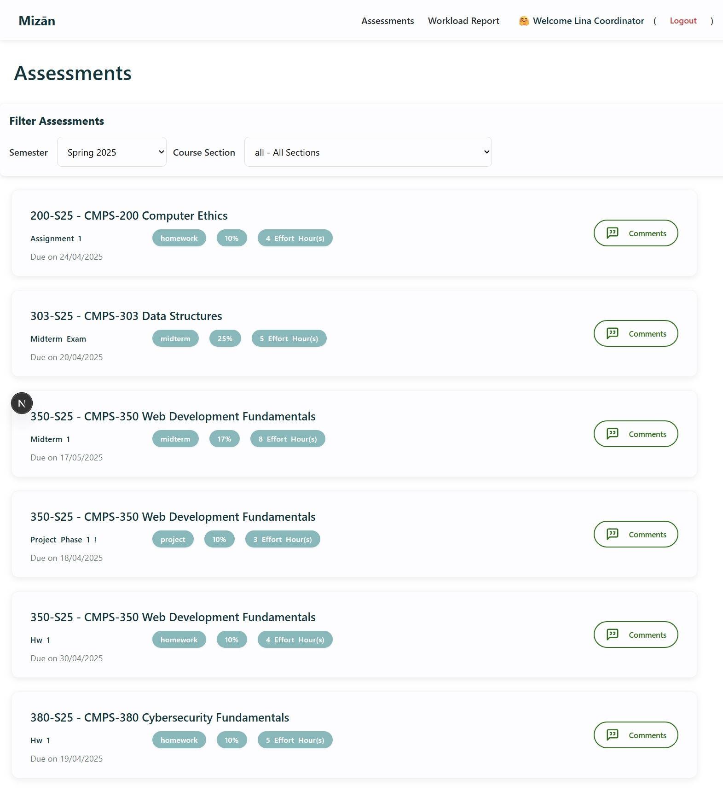
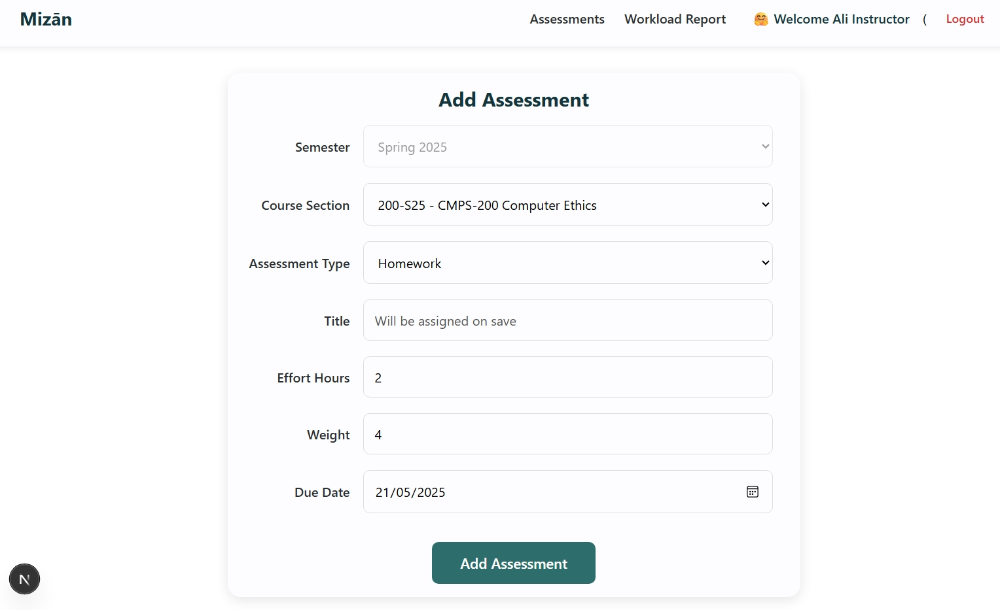

# ميزان Mizān — Academic Workload Manager

> A full-stack web application that helps university students and instructors manage course assessments, track workload, and stay on top of deadlines.

---

## 🚀 Tech Stack

| Layer | Technology |
|-------|-----------|
| Framework | Next.js 15 (App Router) |
| Language | JavaScript (React 19) |
| Database | SQLite via Prisma ORM |
| Charts | Chart.js + react-chartjs-2 |
| Icons | Lucide React |

---

## ✨ Features

- **Role-Based Access Control** — Three distinct user roles: Student, Instructor, and Coordinator, each with tailored views and permissions
- **Assessment Management** — Full CRUD for assessments with strict validation rules (e.g. max 2 midterms, 1 final, 8 homeworks, no duplicate due dates)
- **Workload Calendar** — Monthly calendar view with color-coded assessment types for students
- **Google Calendar Sync** — One-click sync of assessments to Google Calendar
- **Course Comments** — Threaded discussion per course section with role-based moderation
- **Workload Reports** — Visual summaries of effort hours, upcoming deadlines, and assessment breakdowns per course

---

## 📸 Screenshots

### Login Page


### Coordinator Dashboard


### Assessment Management


### Workload Report


---

## 🗄️ Database Schema

The app uses **Prisma with SQLite** and includes the following models:

- `User` — Students, Instructors, Coordinators
- `Section` — Course sections with CRN, instructor, and program info
- `Assessment` — Linked to sections with type, due date, effort hours, and weight
- `Comment` — Threaded comments per section with author and reply support
- `Semester` / `AssessmentType` — Reference data

---

## ⚙️ Getting Started

### Prerequisites
- Node.js 18+
- npm

### Installation

```bash
# Clone the repository
git clone https://github.com/YOUR_USERNAME/mizan-workload-manager.git
cd mizan-workload-manager/phase2/mizan

# Install dependencies
npm install

# Set up environment variables
echo 'DATABASE_URL="file:./prisma/dev.db"' > .env

# Run database migrations
npx prisma migrate dev

# Seed the database with sample data
npx prisma db seed

# Start the development server
npm run dev
```

Open [http://localhost:3000](http://localhost:3000) in your browser.

### Sample Login Credentials

| Role | Email | Password |
|------|-------|----------|
| Student | student@qu.edu.qa | password |
| Instructor | instructor@qu.edu.qa | password |
| Coordinator | coordinator@qu.edu.qa | password |

> Check `prisma/seed.js` for the actual seeded credentials.

---

## 👥 Team

Developed as part of the **CMPS350 – Web Development** course at Qatar University.

---

## 📄 License

This project was developed for academic purposes.
